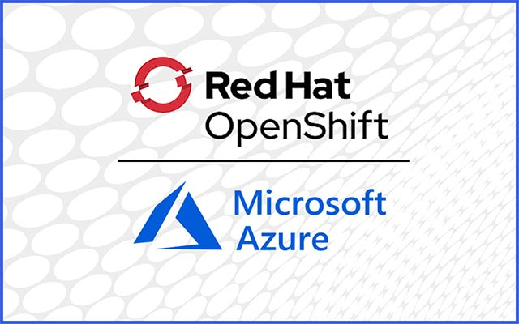
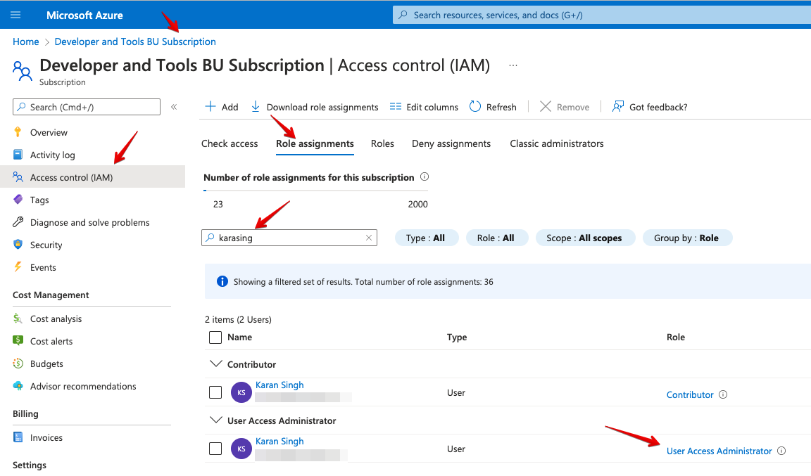

## What is ARO
Azure Red Hat OpenShift (ARO) is a fully-managed service of Red Hat OpenShift on Azure, Jointly engineered, managed, and supported by Microsoft and Red Hat. 

## Prerequisites

- Azure account with portal access
- Make sure your Azure User account has `Microsoft.Authorization/roleAssignments/write` permissions, such as `User Access Administrator` or `Owner` [more info here](https://docs.microsoft.com/en-us/azure/role-based-access-control/built-in-roles)



- The default Azure resource quota for a new Azure subscription is 10 and does not meet this requirement. Increase quota from 10 to minimum 40 [by following this guide](https://docs.microsoft.com/en-us/azure/azure-portal/supportability/per-vm-quota-requests)

- Launch Azure Cloud Shell from Azure Portal (top right). 
- Export some variables that we will often use in the rest of the tutorial.
```
export LOCATION=centralindia
export RESOURCEGROUP=ksingh-resource-group-india
export CLUSTER=azureopenstack
```
- Verify the quota
```
az vm list-usage -l $LOCATION \
--query "[?contains(name.value, 'standardDSv3Family')]" \
-o table
```
-  Grab subscription ID from Azure Portal
```
az account set --subscription <SUBSCRIPTION ID>
```
## Launching ARO Cluster

```
# Register the resource providers

az provider register -n Microsoft.RedHatOpenShift --wait
az provider register -n Microsoft.Compute --wait
az provider register -n Microsoft.Storage --wait
az provider register -n Microsoft.Authorization --wait

# Create a resource group

az group create --name $RESOURCEGROUP --location $LOCATION

# Create a virtual network

az network vnet create --resource-group $RESOURCEGROUP --name aro-vnet --address-prefixes 10.0.0.0/22

# Create two subnets in aro-vnet network for OpenShift control plane (master) and worker nodes

az network vnet subnet create --resource-group $RESOURCEGROUP --vnet-name aro-vnet --name master-subnet --address-prefixes 10.0.0.0/23 --service-endpoints Microsoft.ContainerRegistry

az network vnet subnet create --resource-group $RESOURCEGROUP --vnet-name aro-vnet --name worker-subnet --address-prefixes 10.0.2.0/23 --service-endpoints Microsoft.ContainerRegistry

# Update master node subnet network policy

az network vnet subnet update --name master-subnet --resource-group $RESOURCEGROUP --vnet-name aro-vnet --disable-private-link-service-network-policies true

# Finally, create ARO cluster with default configuration

az aro create --resource-group $RESOURCEGROUP --name $CLUSTER --vnet aro-vnet --master-subnet master-subnet --worker-subnet worker-subnet 
```

## Connect to ARO
- (GUI) Grab OpenShift Console URL and credentials
```
az aro show --name $CLUSTER --resource-group $RESOURCEGROUP --query "consoleProfile.url" -o tsv
az aro list-credentials --name $CLUSTER --resource-group $RESOURCEGROUP
```
- (CLI) Install OpenShift Client `oc`
```
cd ~
wget https://mirror.openshift.com/pub/openshift-v4/clients/ocp/latest/openshift-client-linux.tar.gz

mkdir openshift
tar -zxvf openshift-client-linux.tar.gz -C openshift
echo 'export PATH=$PATH:~/openshift' >> ~/.bashrc && source ~/.bashrc

apiServer=$(az aro show -g $RESOURCEGROUP -n $CLUSTER --query apiserverProfile.url -o tsv)
oc login $apiServer -u kubeadmin -p <kubeadmin password>
```
## Summary
The experience of launching OpenShift cluster from Azure Cloud Shell `aro` is very simple and easy. 
Hope this guide helps you, See You Next Time o/